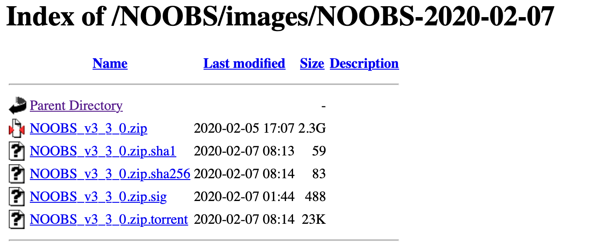

# Rasbian OS (32bit) setup

64bitOSではAudio Adapterがうまく動作しないので、作成したincoming_record.pyを動作させるため、デバック完了するまで暫定処置として RasbianOSの32bit版を使用する。

RasbianOSの32bit版はRaspberry PI Imagerで対応していないのでNOOBSを使用してインストールする

## NOOBS

RasbianOSの保存場所

-   [https://downloads.raspberrypi.com/NOOBS/images](https://downloads.raspberrypi.com/NOOBS/images/){target="_blank"}

`/NOOBS/images/NOOBS-2020-02-07`を選択する、他のカーネルが必要な場合はzipファイルにあるrelease_notes.txtからカーネルバージョンを調べてNOOBSのバージョンを選ぶ

{width="391"}

[**zipファイルのみ**]{.ul}をダウンロードしてSDカードにコピー、電源を入れてHDMIを接続すればインストール選択画面が表示される。指示に従ってインストールを実行する

## 基本設定

HDMIにモニターを接続して、マウスとキーボードを設定後

1.  SSHの設定

2.  パスワード

3.  WiFiの設定

4.  タイムゾーン

<!-- -->

    sudo timedatectl set-timezone Asia/Tokyo

ホスト側SSHキー再設定を必要に応じて行う

    ssh-keygen -R 192.168.3.4 #ipアドレスはifconfigで確認する

## ファームウェアの確認

    pi@raspberrypi:~ $ uname -a
    Linux raspberrypi 4.19.97-v7l+ #1294 SMP Thu Jan 30 13:21:14 GMT 2020 armv7l GNU/Linux

## システムの更新

    sudo apt -y update
    sudo apt -yV upgrade
    sudo apt -yV autoremove
    sudo apt autoclean

必要なライブラリを導入

    sudo apt install -y android-tools-adb android-tools-fastboot
    sudo apt install -y audacity
    sudo apt install -y libportaudio2 libportaudiocpp0 portaudio19-dev 

## VNCの設定

ポートは`5901`を使用

    sudo apt install -y tightvncserver
    tightvncserver 

## USB Audio Adapterの動作確認

### Device情報を確認する {.unnumbered}

    aplay -l

    **** ハードウェアデバイス PLAYBACK のリスト ****
    カード 0: ALSA [bcm2835 ALSA], デバイス 0: bcm2835 ALSA [bcm2835 ALSA]
      サブデバイス: 7/7
      サブデバイス #0: subdevice #0
      サブデバイス #1: subdevice #1
      サブデバイス #2: subdevice #2
      サブデバイス #3: subdevice #3
      サブデバイス #4: subdevice #4
      サブデバイス #5: subdevice #5
      サブデバイス #6: subdevice #6
    カード 0: ALSA [bcm2835 ALSA], デバイス 1: bcm2835 IEC958/HDMI [bcm2835 IEC958/HDMI]
      サブデバイス: 1/1
      サブデバイス #0: subdevice #0
    カード 0: ALSA [bcm2835 ALSA], デバイス 2: bcm2835 IEC958/HDMI1 [bcm2835 IEC958/HDMI1]
      サブデバイス: 1/1
      サブデバイス #0: subdevice #0
    カード 1: Device [Plugable USB Audio Device], デバイス 0: USB Audio [USB Audio]
      サブデバイス: 1/1
      サブデバイス #0: subdevice #0

### カード番号とデバイス番号の確認 {.unnumbered}

incoming_record.pyの構成情報に使用

カード番号：1 デバイス番号：０

    pi@raspberrypi:~ $ arecord -l
    **** ハードウェアデバイス CAPTURE のリスト ****
    カード 1: Device [Plugable USB Audio Device], デバイス 0: USB Audio [USB Audio]
      サブデバイス: 1/1
      サブデバイス #0: subdevice #0

### 録音 {.unnumbered}

AndroidのイヤホンとUSB Audio Adapterのマイク（赤）を接続

    arecord -D plughw:1,0 -f cd -c 1 -r 44100 test.wav

<kbd class="key">Ctrl-C</kbd>で録音ストップ

- Androidの音量はLevel6 <- 最小で良い

## Python

Pythonのバージョン確認

    pi@raspberrypi:~ $ python3 -V
    Python 3.7.3

Pythonライブラリを導入

    pip3 install pyaudio

    pip3 list | egrep "numpy|Audio"
    numpy             1.16.2
    PyAudio           0.2.14

## SDカードのバックアップ作成

作成したカスタムイメージのバックアップ作成はMacから行う、SDカードのマウント先が異なる場合があるかもしれない。以下はSDカードのマウント先は`/dev/disk4`にある想定

作業ディレクトリへ移動

    cd /tmp

イメージの吸い出し

    sudo dd if=/dev/rdisk4 of=raspberry-backup.img bs=1m

SDカードの入れ替え

    diskutil unmountDisk /dev/disk4

イメージを新しいSDカードへコピー

    sudo dd if=./raspberry-backup.img of=/dev/rdisk4 bs=1m
